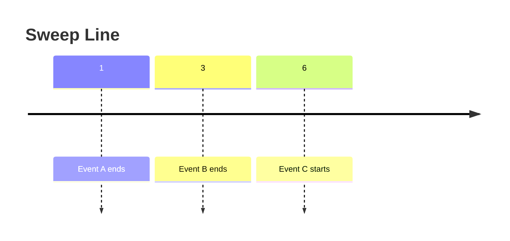

# High-Leverage Python & Algorithm Patterns brainstorming

This document captures **rare but extremely useful patterns** that repeatedly appear
in medium–hard LeetCode problems and system-style interviews.

The goal is **recognition + fast recall**, not theory.
---

## 1. `zip()` — Parallel Iteration & Transpose

### Core idea
`zip()` groups elements index-wise across iterables.

```python
zip(a, b)  →  (a[0], b[0]), (a[1], b[1]) ...
```
### Transpose trick
```python
matrix = [[1,2,3], [4,5,6]]
list(zip(*matrix))
# [(1,4), (2,5), (3,6)]
```

## 2. itemgetter() — Fast, Readable Sorting
### What it does

Extracts elements by index or key (implemented in C).
```python
from operator import itemgetter
sorted(events, key=itemgetter(1))
```
**Equivalent to** 

``python 
sorted(events, key=lambda x: x[1])
```

### Multi-key extraction
```python
itemgetter(0, 2)([10, 20, 30])  # (10, 30)
```
**When to use** a) Sorting intervals b) Sorting tuples c) Cleaner than lambda in interviews

## 3. deque — O(1) Front Operations
**Problem**
```python
list.pop(0)  # O(n)
```

**Solution**
```python
from collections import deque
dq = deque([1,2,3])
dq.popleft()  # O(1)
```
**Typical use cases** a) Sliding window b) BFS c) Sweep-line algorithms d) Queue behavior

## 4. Sweep Line + Running Maximum (Very High Yield)
**Core pattern**
Sort by time → sweep forward → maintain best so far.
```python
while ended_events and ended_events[0].end < current.start:
    best = max(best, ended_events.popleft().value)
```
**Math intuition**
```latex
max(a + x, b + x, c + x) = x + max(a, b, c)
```
**Mermaid intuition**

Only events ending before the start are relevant.


